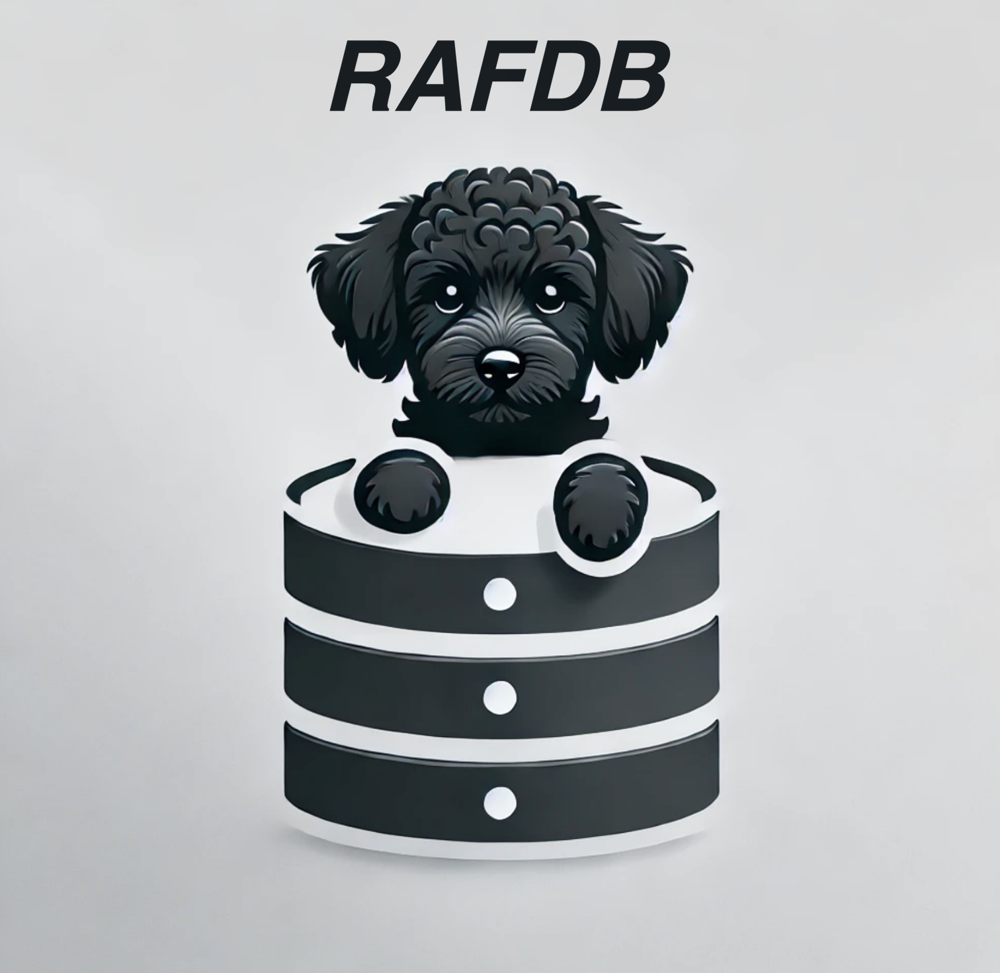

# RAFDB
**<i>Reliable and Fast Database inspired by my dog Rafah. Created by Parth, Rafah & Cursor at a coffee shop on 2025-09-22.</i>**

<center></center>

RAFDB is a fast, reliable NoSQL database written in Go with a RESTful HTTP API. It features in-memory storage with disk persistence, concurrent access handling, and a simple document-based data model.

## Features

- 🚀 **Fast**: In-memory storage with optimized concurrent access
- 🔒 **Reliable**: Thread-safe operations with proper locking mechanisms
- 💾 **Persistent**: Automatic data persistence to disk
- 🌐 **RESTful API**: Complete HTTP API for all database operations
- 🐳 **Docker Ready**: Containerized deployment with Docker and Docker Compose
- 📊 **Queryable**: Simple field-based querying system
- 📈 **Observable**: Built-in statistics and health monitoring

## Quick Start

### Option 1: Docker Deployment (Recommended)

```bash
# Deploy with Docker Compose
just deploy-rafdb

# Or manually with Docker
just docker-build
just docker-run
```

### Option 2: Local Development

```bash
# Install dependencies
just deps

# Run locally
just run

# Or build and run
just build
./rafdb
```

## Testing the Database

### 1. Automated Testing

Run the comprehensive test suite that demonstrates all database features:

```bash
# Test with sample data (creates users, queries, updates)
just test-db

# Load test with 1000 documents
just load-test

# Performance benchmark
just benchmark
```

### 2. Manual API Testing

Once RAFDB is running (on `http://localhost:8080`), you can test the API manually:

#### Health Check
```bash
curl http://localhost:8080/api/v1/health
```

#### Create a Collection
```bash
curl -X POST http://localhost:8080/api/v1/collections \
  -H "Content-Type: application/json" \
  -d '{"name": "products"}'
```

#### Insert Documents
```bash
# Insert a product
curl -X POST http://localhost:8080/api/v1/collections/products/documents \
  -H "Content-Type: application/json" \
  -d '{
    "id": "prod1", 
    "data": {
      "name": "Laptop", 
      "price": 999.99, 
      "category": "Electronics",
      "in_stock": true
    }
  }'

# Insert another product
curl -X POST http://localhost:8080/api/v1/collections/products/documents \
  -H "Content-Type: application/json" \
  -d '{
    "id": "prod2", 
    "data": {
      "name": "Coffee Mug", 
      "price": 12.99, 
      "category": "Kitchen",
      "in_stock": false
    }
  }'
```

#### Retrieve Documents
```bash
# Get a specific document
curl http://localhost:8080/api/v1/collections/products/documents/prod1

# List all documents in collection
curl http://localhost:8080/api/v1/collections/products/documents
```

#### Query Documents
```bash
# Find all products in Electronics category
curl -X POST http://localhost:8080/api/v1/collections/products/query \
  -H "Content-Type: application/json" \
  -d '{"field": "category", "value": "Electronics"}'

# Find all in-stock products
curl -X POST http://localhost:8080/api/v1/collections/products/query \
  -H "Content-Type: application/json" \
  -d '{"field": "in_stock", "value": true}'
```

#### Update Documents
```bash
curl -X PUT http://localhost:8080/api/v1/collections/products/documents/prod1 \
  -H "Content-Type: application/json" \
  -d '{
    "data": {
      "name": "Gaming Laptop", 
      "price": 1299.99, 
      "category": "Electronics",
      "in_stock": true,
      "specs": {"ram": "16GB", "storage": "1TB SSD"}
    }
  }'
```

#### Delete Documents
```bash
curl -X DELETE http://localhost:8080/api/v1/collections/products/documents/prod2
```

#### Database Statistics
```bash
curl http://localhost:8080/api/v1/stats
```

#### List Collections
```bash
curl http://localhost:8080/api/v1/collections
```

### 3. Performance Testing

Test RAFDB's performance under load:

```bash
# Run load test (1000 documents)
just load-test

# Run benchmark (measures read/write performance)
just benchmark
```

## API Reference

### Collections

- `GET /api/v1/collections` - List all collections
- `POST /api/v1/collections` - Create a new collection
- `DELETE /api/v1/collections/{collection}` - Delete a collection

### Documents

- `GET /api/v1/collections/{collection}/documents` - List all documents
- `POST /api/v1/collections/{collection}/documents` - Insert a document
- `GET /api/v1/collections/{collection}/documents/{id}` - Get a document
- `PUT /api/v1/collections/{collection}/documents/{id}` - Update a document
- `DELETE /api/v1/collections/{collection}/documents/{id}` - Delete a document

### Querying

- `POST /api/v1/collections/{collection}/query` - Query documents by field value

### System

- `GET /api/v1/health` - Health check
- `GET /api/v1/stats` - Database statistics

## Development

### Available Commands

```bash
# Development
just deps          # Install dependencies
just build         # Build the application
just run           # Run locally
just dev           # Run with live reload (requires air)
just test          # Run Go tests
just fmt           # Format code
just lint          # Lint code (requires golangci-lint)

# Database Testing
just test-db       # Test with sample data
just load-test     # Load test with 1000 documents
just benchmark     # Performance benchmark

# Docker
just docker-build  # Build Docker image
just docker-run    # Run with Docker
just deploy-rafdb  # Deploy with Docker Compose

# Utilities
just clean         # Clean build artifacts
just help          # Show help
```

### Data Persistence

RAFDB automatically persists data to `rafdb_data.json` in the working directory. The database:

- Loads existing data on startup
- Saves data on graceful shutdown (Ctrl+C)
- Maintains data consistency with proper locking

### Architecture

- **Storage Layer**: Thread-safe in-memory storage with disk persistence
- **API Layer**: RESTful HTTP API with JSON responses
- **Concurrency**: Read-write locks for optimal concurrent access
- **Persistence**: JSON-based disk storage with atomic writes

## Docker Deployment

### Using Docker Compose (Recommended)

```bash
# Start RAFDB
docker-compose up -d

# View logs
docker-compose logs -f

# Stop RAFDB
docker-compose down
```

### Using Docker Directly

```bash
# Build image
docker build -t rafdb:latest .

# Run container
docker run -d -p 8080:8080 -v rafdb_data:/home/rafdb/data rafdb:latest
```

## Configuration

RAFDB uses sensible defaults but can be configured via environment variables:

- `RAFDB_DATA_FILE`: Path to data file (default: `rafdb_data.json`)
- `PORT`: Server port (default: `8080`)

## Contributing

1. Fork the repository
2. Create a feature branch
3. Make your changes
4. Run tests: `just test`
5. Submit a pull request

## License

MIT License - see LICENSE file for details.

---

**Built with ❤️ by Parth, Rafah & Cursor**